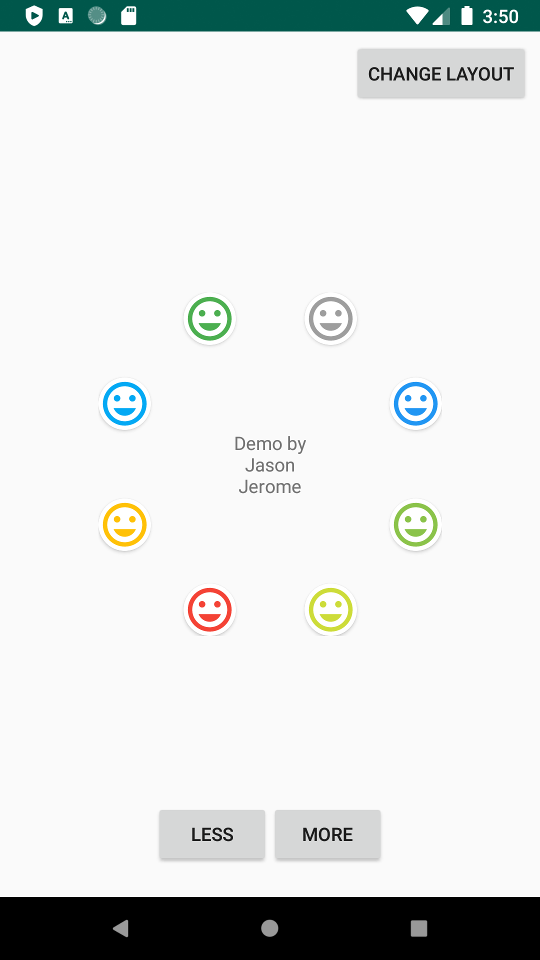
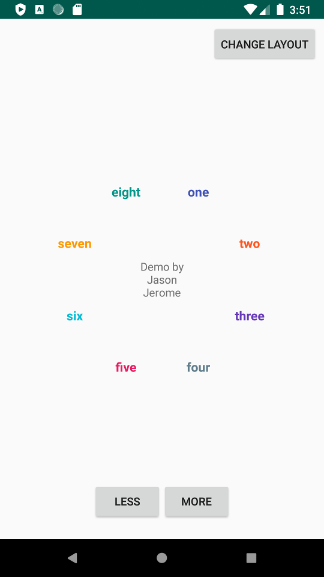

# Circle Layout

A demo of using a custom view to build a ConstraintLayout with circular constraints.

ConstraintLayout has an option to constrain to a circle. You give it the view to use as the center, then constrain each view to the center. You need to give it the radius (distance from the center), and the circular angle (1-360 degrees). Just like building a clock face.

I wanted to be able to add and remove the views in the circle. This involved creating a custom view where I create each view and constrain it in code. It's something that you may not do very often, and seemed like it would be fun to learn.

It may or may not be the best way to do it.
Use at your own risk!

## Brief explanation

My custom view is called `CircularIconLayout`

I base the views in the circle on a **section count** (`sectionCount`).

1. I create a TextView and constrain it to the center (`centerView`)
2. Create a view for each view that is requested (`sectionCount`)
3. Calculate where to place the views:
    * divide the number of sections by 360 (example: 360 / 4 = 25 degrees)
    * determine the cetner of each section (example: 25 / 2 = 12.5 degrees)
4. Create a constraint for each view using constrainCircle()

* I keep a list of the views for reference (`sectionList`)
* When the user changes the number of sections, I update the list and re-constrain everything to the `centerView` again

## Everything else

Everything else is there because I was playing around with making it look cool. I'm sorry if that adds any confusion.

faces                      |  Words
:-------------------------:|:-------------------------:
  |  

### Demo

